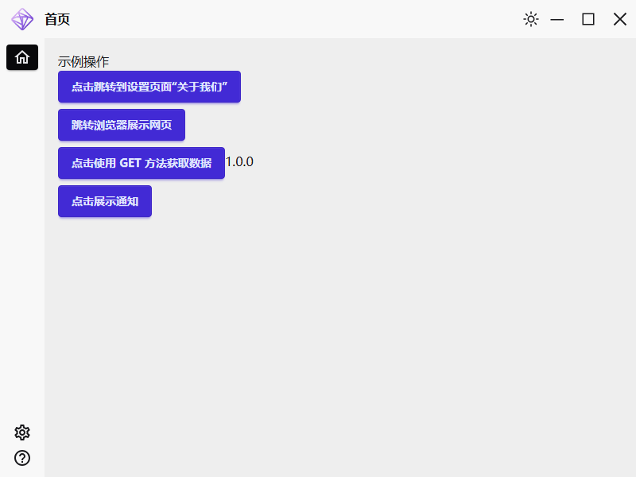

# Truss Tauri

Trurss Tauri 是 [Truss](https://truss.mortnon.tech)模板示例中针对应用的模板。

模板中实现了一个基础的 Windows 应用结构，提供了常用的菜单、页面扩展，开发了基础的`通用设置`和`关于我们`配置项。

同时，在项目中提供了跨域的 http 支持，集成了 tauri 的通知能力。

基于以上结构与工具，用户可以快速开发自己的 Windows 应用，并能快速扩展开发 Mac 应用。

未来，将提供更丰富的基础能力和扩展工具集。

相关使用帮助，可参阅以下帮助，也可查看[Truss 官网](https://truss.mortnon.tech)。



## 帮助说明

- [项目源码结构及资料](./docs/framework.md)

## 技术栈

### 前端框架

- [Next.js](https://nextjs.org/)
- [Tailwind CSS](https://tailwindcss.com/)
- [daisyUI](https://daisyui.com/)
- [react-icons](https://react-icons.github.io/react-icons/)
- [next-intl](https://github.com/amannn/next-intl)
- [js-cookie](https://github.com/js-cookie/js-cookie)
- [theme-change](https://github.com/saadeghi/theme-change)

### 运行、编译环境

1. 安装环境依赖

[参考链接](https://tauri.app/start/prerequisites/#_top)

- 注意：

国内安装 rust 由于网络原因，会很慢，会很容易失败。如果失败了，可以在当前用户目录下，找到 `.cargo` 目录，新建配置文件 `cargo.toml`，填写国内镜像源地址后再安装，中国科学技术大学的镜像源示例如下：

```toml
[source.crates-io]
replace-with = 'ustc'

[source.ustc]
registry = "https://mirrors.ustc.edu.cn/crates.io-index"

[net]
git-fetch-with-cli = true
```

2. 本地开发、运行

```
# 安装依赖
pnpm install

# 启动tauri客户端版
pnpm tauri dev

# 启动web版
pnpm dev
```
