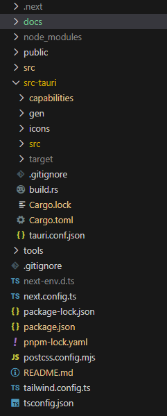

# 项目源码结构及资料

项目源码结构如下图：

## 核心目录及文件

- `docs` 相关文档
- `public` Nextjs 前端所依赖的静态资源，如图片等
- `src` Nextjs 源码等
  - `app` Nextjs 源码
    - `(business)` 主菜单对应的页面，如 `首页`、`设置`等
    - `components` 封装的组件
    - `lib` 基础对象，如国际化 `i18n`
    - `utils` 基础工具等
  - `locales` 国际化语言文件
- `src-tauri` tauri 源码及配置
  - `capabilities` 权限配置
  - `icons` 应用图标
  - `src` 源码
    - `lib.rs` 使用 Rust 扩展功能
  - `tauri.conf.json` 应用配置

## 资料

### Tauri

- [Tauri 官网](https://tauri.app/)
- [Tauri 插件](https://tauri.app/plugin/)

项目中使用的是 Tauri 2.0，与 Tauri 1.0 有较多差异，如果使用 AI 辅助开发，注意提示词中强调版本。

### Nextjs

- [Nextjs 官网]（https://nextjs.org/）

项目中使用的是 Nextj 的 App Router 模式，所以在 `src` 目录下存在 `app` 目录。

### Tailwindcss

- [Tailwindcss 官网](https://tailwindcss.com/)

#### daisyUI

- [daisyUI 官网](https://daisyui.com/)

daisyUI 基于 Tailwindcss，有一些现成的组件，适合快速开发。
